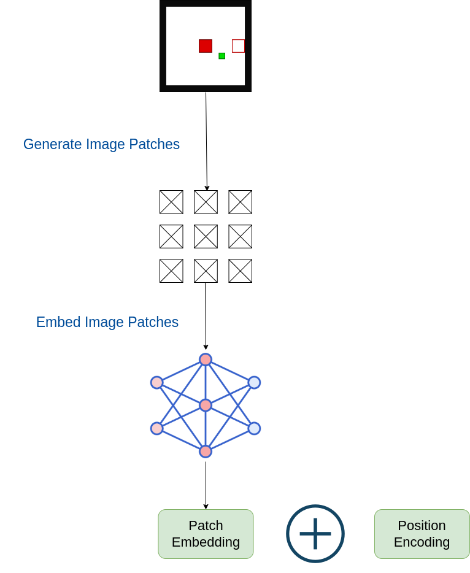

```
image_tokenizer.py -> implementation of image tokenizer
value_tokenizer.py -> implementation of tokenizer for discrete/continuous valued tensors
text_tokenizer.py -> implementation of text tokenizer
```

## Image Tokenizer



